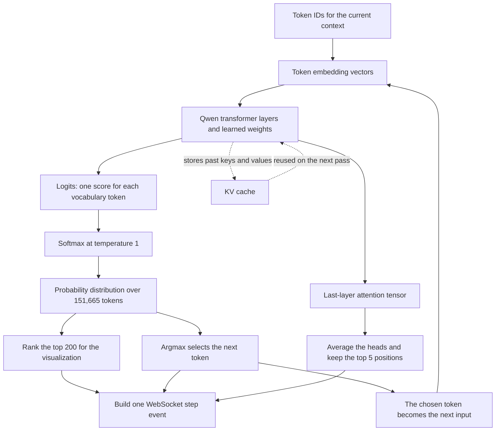

# Token Atlas

> A live 3D view of how a language model chooses its next token.

I built Token Atlas to get a high-level visual of how an LLM decides what to say next. The model's
151,665 possible tokens are mapped as nodes in 3D; while Qwen generates an answer, the app lights
up the tokens with the highest probabilities, marks the chosen token, and draws its path through
the map. I also used the project to learn the backend math behind generation: how learned weights
turn token embeddings into logits, how softmax turns those scores into probabilities, and how
temperature, top-k, and greedy decoding change the final choice.

**Full write-up:** [Coming soon]()

**Live demo:** [Open Token Atlas](https://www.ivansostaric.com/projects/token-atlas/demo)

The demo is designed for a laptop or desktop browser.

## How it works

The backend runs one forward pass for every generated token. The first pass sends the full
tokenized context through `Qwen/Qwen2.5-0.5B-Instruct`. Qwen returns the next-token logits, its KV
cache, and the attention tensors. Every later pass sends only the token that was just chosen and
reuses the cache for everything that came before it.



I wrote this loop manually instead of calling `model.generate()` because the completed text is not
enough for the visualization. I need the full probability distribution and attention data at every
step. Token Atlas uses greedy decoding, so it always selects the highest-probability token and the
same prompt is reproducible. The top 200 candidates are ranked for display; top-k sampling does not
control the choice in this demo.

The vocabulary projection is computed offline and stored as a compact Float32 coordinate file.
In the browser, all 151,665 field points are drawn with one GPU buffer rather than one React object
per token. Candidate nodes, attention links, the generated path, and field points all use the same
coordinate mapping.

FastAPI streams the step events over one WebSocket. The React frontend stores those events
separately from playback, so generation can finish quickly while the viewer pauses or rewinds at
their own pace. The backend is deployed on Modal and the frontend is built with Vite and hosted on
Vercel.

## Reading the visualization

This is not a chain-of-thought viewer. Attention weights show where the model placed attention,
but they do not prove why it chose a token.

The probabilities come directly from the model's next-token distribution. Position comes from a
3D UMAP projection, which is useful for seeing neighbourhoods but cannot preserve every distance
from the original embedding space. The default spread control makes the dense centre easier to
read; setting it to zero restores the raw projected coordinates.

## What I learned

Before this project, I understood next-token prediction mostly at the API level. Building the
backend made the process much more concrete. A token ID first selects a row from the embedding
matrix. The transformer then passes that vector through layers of learned weight matrices while
mixing in the context. The final hidden vector is projected into one logit for every vocabulary
token. The weights do not store a finished sentence; together, they transform the current context
into those next-token scores.

Logits are not probabilities yet. Softmax converts them into a distribution:

```text
p(token i) = exp(logit i / T) / sum(exp(logit j / T))
```

`T` is temperature. A lower value makes the largest logits dominate, while a higher value spreads
probability across more tokens. Top-k sampling would restrict sampling to the `k` highest scores.
For this project I keep `T = 1`, show the top 200 probabilities, and use argmax instead of sampling.
That makes the model's decision repeatable while still exposing the alternatives it considered.

I also learned what sits behind an attention visualization. Each transformer layer builds query,
key, and value matrices. The expression `softmax(QK^T / sqrt(d))` produces the attention weights,
which are then applied to the value matrix. Token Atlas reads the newest row from the final layer,
averages its heads, and shows the five highest-weight context positions. Those weights are useful
signals, but they are not a complete explanation of why the model chose a token.

The KV cache was the implementation detail that tied the loop together. After the first pass, the
model already has the key and value tensors for the earlier context. Sending the whole sequence
again would duplicate that context. Reusing the cache and sending only the newest token is what
makes step-by-step generation both correct and fast enough to stream live.

## Tech stack

- **Model and backend:** Python, PyTorch, Hugging Face Transformers, FastAPI, WebSockets
- **Frontend:** React, Three.js, React Three Fiber, Vite
- **Projection and hosting:** NumPy, UMAP, Modal, Vercel
