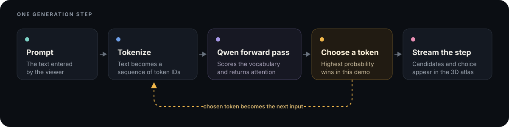

# Token Atlas

> A live 3D view of how a language model chooses its next token.

I built Token Atlas to get a high-level visual of how an LLM decides what to say next. The model's
151,665 possible tokens are mapped as nodes in 3D; while Qwen generates an answer, the app lights
up the tokens with the highest probabilities, marks the chosen token, and draws its path through
the map. I also used the project to learn the backend math behind generation: how learned weights
turn token embeddings into logits, how softmax turns those scores into probabilities, and how
temperature, top-k, and greedy decoding change the final choice.

**Full write-up:** [Read the full Token Atlas write-up](https://www.ivansostaric.com/projects/token-atlas)

**Live demo:** [Open Token Atlas](https://www.ivansostaric.com/projects/token-atlas/demo)

The demo is designed for a laptop or desktop browser.

## How it works

The backend runs a manual generation loop. It tokenizes the prompt, passes it through
`Qwen/Qwen2.5-0.5B-Instruct`, ranks the possible next tokens, and chooses the one with the highest
probability. It also collects the top 200 candidates and the five context positions with the
strongest attention, then streams that step to the browser.



The project uses a manual decoding loop instead of `model.generate()` because the completed answer
does not include the data needed for the visualization. Each step exposes the candidates, chosen
token, and attention data before the chosen token is fed back into the model.

The vocabulary projection is computed offline and stored as a compact Float32 coordinate file.
In the browser, all 151,665 field points are drawn with one GPU buffer rather than one React object
per token. Candidate nodes, attention links, the generated path, and field points all use the same
coordinate mapping.

FastAPI streams the step events over one WebSocket. The React frontend stores those events
separately from playback, so generation can finish quickly while the viewer pauses or rewinds at
their own pace. The backend is deployed on Modal and the frontend is built with Vite and hosted on
Vercel.

## What I learned

Before this project, I understood next-token prediction mostly at the API level. Building the
backend made the process much more concrete. I learned how a prompt becomes token IDs, how the
model's learned weights score every token in its vocabulary, and how those scores become the next
choice. I also got a clearer picture of what temperature, top-k, and greedy decoding actually
change during generation.

Working directly with the model also taught me how attention and the KV cache fit into a real
generation loop. Attention is useful for showing which earlier positions received more weight, but
it is not a complete explanation of the model's reasoning. The cache lets the model reuse past
context instead of processing the full sequence again for every new token, which made the live
visualization practical.

## Tech stack

- **Model and backend:** Python, PyTorch, Hugging Face Transformers, FastAPI, WebSockets
- **Frontend:** React, Three.js, React Three Fiber, Vite
- **Projection and hosting:** NumPy, UMAP, Modal, Vercel

## Running it locally

The first model load downloads ~1 GB into `~/.cache/huggingface/hub`, once. Everything runs on CPU.

```bash
python3 -m venv .venv && source .venv/bin/activate
pip install -r backend/requirements.txt
```

Backend on :8000, frontend on :5173 — both need to be running to generate:

```bash
cd backend && ../.venv/bin/python -m uvicorn app.main:app --reload --port 8000
```

```bash
cd frontend && npm install && npm run dev
```

`GET /health` reports whether the model is loaded. `WS /ws` takes
`{"prompt": "...", "max_tokens": 60}` and streams `step` events followed by `done`.

To watch a whole generation in the terminal — every step's candidates, probabilities and
attention, with no browser involved:

```bash
./.venv/bin/python backend/scripts/run_local.py "What is the capital of France?"
```

## Tests

No test runner to install; both suites use what the language ships with.

```bash
python3 -m unittest discover -s backend/tests -t .
```

```bash
cd frontend && npm test
```

## Deploying

The backend is a plain container with no vendor SDK, which is what keeps the hosting choice
swappable — `deploy/modal_app.py` is the only file that mentions Modal.

```bash
modal deploy deploy/modal_app.py
```

**The frontend and backend deploy separately, and shipping one is not shipping the other.** Several
guarantees live in the backend — full probability precision, the WebSocket origin check, and the
rate limits — so a frontend-only release leaves those unchanged in production. After changing
anything under `backend/`, redeploy and then confirm against the live URL rather than assuming:

```bash
curl -s https://<your-modal-url>/health
```

Every public frontend origin must also appear in `FRONTEND_ORIGINS` in `deploy/modal_app.py`; run
`modal deploy` again after changing that tuple or the new origin cannot connect.

Vercel builds the frontend from `frontend/`. `VITE_API_URL` is substituted at **build** time, so it
has to be set before the build runs — it lives in the committed `frontend/.env.production`, which
keeps the deploy reproducible from a clone.
